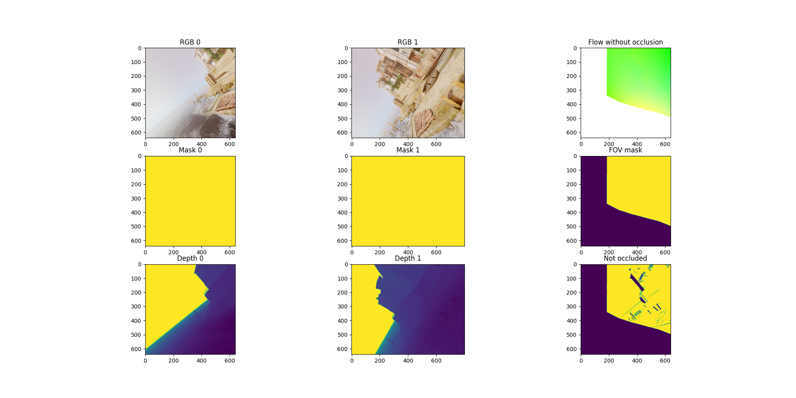

Examples
=====================================

TartanAir V2 is a flexible dataset when used with this Python package. Using it, you can download, iterate, and modify the raw data. Here are some examples of what you can do with it.

Download Example
-------------------------------------

Download via Python API
............................

.. code-block:: python

    import tartanair as ta

    # Initialize TartanAir.
    tartanair_data_root = '/my/path/to/root/folder/for/tartanair-v2'
    ta.init(tartanair_data_root)

    # Download a trajectory.
    ta.download(env = "ArchVizTinyHouseDay", 
                difficulty = ['easy'], # this can be 'easy', and/or 'hard'
                modality = ['image', 'depth', 'seg', 'imu'], # available modalities are: image', 'depth', 'seg', 'imu', 'lidar', 'flow'
                camera_name = ['lcam_front', 'lcam_left', 'lcam_right', 'lcam_back', 'lcam_top', 'lcam_bottom'], 
                unzip = True) # unzip files autonomously after download

Download via a yaml config file
................................
.. code-block:: python
    
    ta.download(config = 'download_config.yaml')

The config file if of the following format:

.. code-block:: yaml

    env: ['ArchVizTinyHouseDay']
    difficulty: ['easy']
    modality: ['image', 'depth']
    camera_name: ['lcam_front', 'lcam_left', 'lcam_right', 'lcam_back', 'lcam_top', 'lcam_bottom']
    unzip: True

Multi-Thread Download via Python API
............................................

.. code-block:: python

    import tartanair as ta
    
    # Create a TartanAir object.
    tartanair_data_root = '/my/path/to/root/folder/for/tartanair-v2'
    
    ta.init(tartanair_data_root)
    
    # Download data from following environments.
    env = [ "Prison",
            "Ruins",
            "UrbanConstruction"]
    ta.download_multi_thread(env = env, 
                             difficulty = ['easy', 'hard'], 
                             modality = ['image', 'depth'],  
                             camera_name = ['lcam_front', 'lcam_right', 'lcam_back', 'lcam_left', 'lcam_top', 'lcam_bottom'], 
                             unzip = True,
                             num_workers = 8)
    
    # To download the entire dataset
    all_data = ta.get_all_data() # this will fill in all available TAv2 data for env, difficulty, modality and camera_name
    ta.download_multi_thread(**all_data, 
                             unzip = True,
                             num_workers = 8)

Download TartanGround
............................

.. code-block:: python

    import tartanair as ta

    # Initialize TartanAir.
    tartanground_data_root = '/my/path/to/root/folder/for/tartanair-v2'
    ta.init(tartanground_data_root)

    # Download a trajectory.
    ta.download_ground(env = ['OldTownSummer', 'DesertGasStation'], 
                version = ['v1', 'v2', 'v3_anymal'], # available versions are: 'v1', 'v2', 'v3_anymal'
                modality = ['image', 'depth', 'seg', 'lidar', 'imu'], # available modalities are: image', 'depth', 'seg', 'imu', 'lidar'
                camera_name = ['lcam_front', 'lcam_bottom'], # available cameras are: 'lcam_front', 'lcam_left', 'lcam_right', 'lcam_back', 'lcam_top', 'lcam_bottom'
                unzip = True) # unzip files autonomously after download

Customization Example
-------------------------------------

TartanAir V2 allows you to synthesize your own dataset by modifying the raw data. For example, by specifying a new camera model and generating images using it.

.. code-block:: python

    import tartanair as ta

    # For help with rotations.
    from scipy.spatial.transform import Rotation

    # Initialize TartanAir.
    tartanair_data_root = '/my/path/to/root/folder/for/tartanair-v2'
    ta.init(tartanair_data_root)

    # Create your camera model(s).
    R_raw_new0 = Rotation.from_euler('y', 90, degrees=True).as_matrix().tolist()

    cam_model_0 =  {'name': 'pinhole', 
                    'raw_side': 'left', # TartanAir has two cameras, one on the left and one on the right. This parameter specifies which camera to use.
                    'params': 
                            {'fx': 320, 
                             'fy': 320, 
                             'cx': 320, 
                             'cy': 320, 
                             'width': 640, 
                             'height': 640},
                    'R_raw_new': R_raw_new0}

    R_raw_new1 = Rotation.from_euler('xyz', [45, 0, 0], degrees=True).as_matrix().tolist()

    cam_model_1 = {'name': 'doublesphere',
                   'raw_side': 'left',
                   'params':
                            {'fx': 300, 
                            'fy': 300, 
                            'cx': 500, 
                            'cy': 500, 
                            'width': 1000, 
                            'height': 1000, 
                            'alpha': 0.6, 
                            'xi': -0.2, 
                            'fov_degree': 195},
                   'R_raw_new': R_raw_new1}

    # Customize the dataset.
    ta.customize(env = 'ArchVizTinyHouseDay', 
                 difficulty = 'easy', 
                 trajectory_id = ['P000'], 
                 modality = ['image', 'depth'], 
                 new_camera_models_params=[cam_model_1, cam_model_0], 
                 num_workers = 4,
                 device = "cuda") # or cpu

Dataloader Example
-------------------------------------
TartanAir-V2 includes a powerful parallelized dataloader. It can be used to load data from the dataset and serve mini-batches in parallel, and also to apply (some) transformations to the data on the fly. We highly recommend that you use it for efficient data loading.

.. code-block:: python

    import tartanair as ta
    import numpy as np
    import cv2

    # Initialize TartanAir.
    tartanair_data_root = '/my/path/to/root/folder/for/tartanair-v2'
    ta.init(tartanair_data_root)

    # Specify the environments, difficulties, and trajectory ids to load.
    envs = ['ArchVizTinyHouseDay']
    difficulties = ['easy']
    trajectory_ids = ['P000', 'P001']

    # Specify the modalities to load.
    modalities = ['image', 'pose', 'imu']
    camnames = ['lcam_front', 'lcam_left', 'lcam_right', 'lcam_back', 'lcam_top', 'lcam_bottom']

    # Specify the dataloader parameters.
    new_image_shape_hw = [640, 640] # If None, no resizing is performed. If a value is passed, then the image is resized to this shape.
    subset_framenum = 200 # This is the number of frames in a subset. Notice that this is an upper bound on the batch size. Ideally, make this number large to utilize your RAM efficiently. Information about the allocated memory will be provided in the console.
    seq_length = {'image': 2, 'pose': 2, 'imu': 10} # This is the length of the data-sequences. For example, if the sequence length is 2, then the dataloader will load pairs of images.
    seq_stride = 1 # This is the stride between the data-sequences. For example, if the sequence length is 2 and the stride is 1, then the dataloader will load pairs of images [0,1], [1,2], [2,3], etc. If the stride is 2, then the dataloader will load pairs of images [0,1], [2,3], [4,5], etc.
    frame_skip = 0 # This is the number of frames to skip between each frame. For example, if the frame skip is 2 and the sequence length is 3, then the dataloader will load frames [0, 3, 6], [1, 4, 7], [2, 5, 8], etc.
    batch_size = 8 # This is the number of data-sequences in a mini-batch.
    num_workers = 4 # This is the number of workers to use for loading the data.
    shuffle = True # Whether to shuffle the data. Let's set this to False for now, so that we can see the data loading in a nice video. Yes it is nice don't argue with me please. Just look at it! So nice. :)

    # Create a dataloader object.
    dataloader = ta.dataloader(env = envs, 
                difficulty = difficulties, 
                trajectory_id = trajectory_ids, 
                modality = modalities, 
                camera_name = camnames, 
                new_image_shape_hw = new_image_shape_hw, 
                seq_length = seq_length, 
                subset_framenum = subset_framenum, 
                seq_stride = seq_stride, 
                frame_skip = frame_skip, 
                batch_size = batch_size, 
                num_workers = num_workers, 
                shuffle = shuffle,
                verbose = True)

    # Iterate over the batches.
    for i in range(100):    
        # Get the next batch.
        batch = dataloader.load_sample()
        # Visualize some images.
        # The shape of an image batch is (B, S, H, W, C), where B is the batch size, S is the sequence length, H is the height, W is the width, and C is the number of channels.

        print("Batch number: {}".format(i+1), "Loaded {} samples so far.".format((i+1) * batch_size))

        for b in range(batch_size):

            # Create image cross.
            left = batch['image_lcam_left'][b][0].numpy().transpose(1,2,0)
            front = batch['image_lcam_front'][b][0].numpy().transpose(1,2,0)
            right = batch['image_lcam_right'][b][0].numpy().transpose(1,2,0)
            back = batch['image_lcam_back'][b][0].numpy().transpose(1,2,0)
            top = batch['image_lcam_top'][b][0].numpy().transpose(1,2,0)
            bottom = batch['image_lcam_bottom'][b][0].numpy().transpose(1,2,0)
            cross_mid = np.concatenate([left, front, right, back], axis=1)
            cross_top = np.concatenate([np.zeros_like(top), top, np.zeros_like(top), np.zeros_like(top)], axis=1)
            cross_bottom = np.concatenate([np.zeros_like(bottom), bottom, np.zeros_like(bottom), np.zeros_like(bottom)], axis=1)
            cross = np.concatenate([cross_top, cross_mid, cross_bottom], axis=0)

            pose = batch['pose_lcam_front'].numpy()
            imu = batch['imu'].numpy()

            # Resize.
            cross = cv2.resize(cross, (cross.shape[1]//4, cross.shape[0]//4))

            # Show the image cross.
            cv2.imshow('cross', cross)
            cv2.waitKey(100)

        print("  Pose: ", pose[0][0])
        print("  IMU: ", imu[0][0])
            
    dataloader.stop_cachers()

Data Iteration Example
-------------------------------------

Create a data iterator to get samples from the TartanAir V2 dataset. The samples include data in the specified modalities.

.. code-block:: python

    import tartanair as ta

    # Initialize TartanAir.
    tartanair_data_root = '/my/path/to/root/folder/for/tartanair-v2'
    ta.init(tartanair_data_root)

    # Create iterator.
    ta_iterator = ta.iterator(env = ['ArchVizTinyHouseDay'], 
                            difficulty = 'easy', 
                            trajectory_id = [], 
                            modality = 'image', 
                            camera_name = ['lcam_left'])

    for i in range(100):
        sample = next(ta_iterator)

Evaluation Example
-------------------------------------

TartanAir also provides tools for evaluating estimated trajectories against the ground truth. The evaluation is based on the ATE and RPE metrics, which can be computed for the entire trajectory, a subset of the trajectory, and also a scaled and shifted version of the estimated trajectory that matched the ground truth better, if that is requested.

.. code-block:: python

    import tartanair as ta
    import numpy as np

    # Initialize TartanAir.
    tartanair_data_root = '/my/path/to/root/folder/for/tartanair-v2'
    ta.init(tartanair_data_root)

    # Create an example trajectory. This is a noisy version of the ground truth trajectory.
    env = 'ArchVizTinyHouseDay'
    difficulty = 'easy'
    trajectory_id = 'P002'
    camera_name = 'lcam_front'
    gt_traj = ta.get_traj_np(env, difficulty, trajectory_id, camera_name)
    est_traj = gt_traj + np.random.normal(0, 0.1, gt_traj.shape)  

    # Pass the ground truth trajectory directly to the evaluation function.
    results = ta.evaluate_traj(est_traj, 
                               gt_traj = gt_traj, 
                               enforce_length = True, 
                               plot = True, 
                               plot_out_path = plot_out_path, 
                               do_scale = True, 
                               do_align = True)

    # Or pass the environment, difficulty, and trajectory id to the evaluation function.
    plot_out_path = "evaluator_example_plot.png"
    results = ta.evaluate_traj(est_traj, 
                               env = env, 
                               difficulty = difficulty, 
                               trajectory_id = trajectory_id, 
                               camera_name = camera_name, 
                               enforce_length = True, 
                               plot = True, 
                               plot_out_path = plot_out_path, 
                               do_scale = True, 
                               do_align = True)

Flow Sampling Example
-------------------------------------

TartanAir V2 also includes a power dense correspondense sampling tool that can be used to calculate desnse correspondences between any points in the same environment. 

The tool supports sampling dense correspondence between any combination of pinhole, fisheye(doublesphere), and equirectangular cameras. Yes, you can sample dense correspondences between different camera models such as pinhole and equirectangular.

Given a pair of RGB and depth image cubes and two direction, the tool will compute dense correspondense represented as optical flow and a occlusion mask signaling is the pixel directly observable.

.. code-block:: python

    import tartanair as ta

    # For help with rotations.
    from scipy.spatial.transform import Rotation

    # Initialize TartanAir.
    tartanair_data_root = 'your/path/to_tav2'
    ta.init(tartanair_data_root)

    # Customize the dataset.
    ta.customize_flow(env = 'ArchVizTinyHouseDay',
                difficulty = 'easy',
                trajectory_id = ['P000'],
                cam_sides=["left", "right"],
                num_workers = 4,
                frame_sep = 1,
                device = "cuda") # or cpu

Please refer to flow_resampling_example.py for a complete example.

To learn more about how the resampling happens, see flow_sampling. 

.. toctree::
   :maxdepth: 1

   flow_sampling