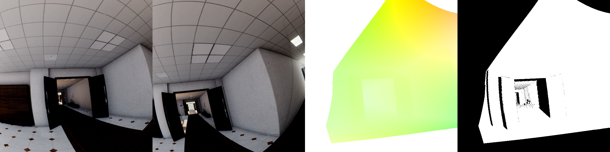
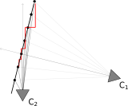
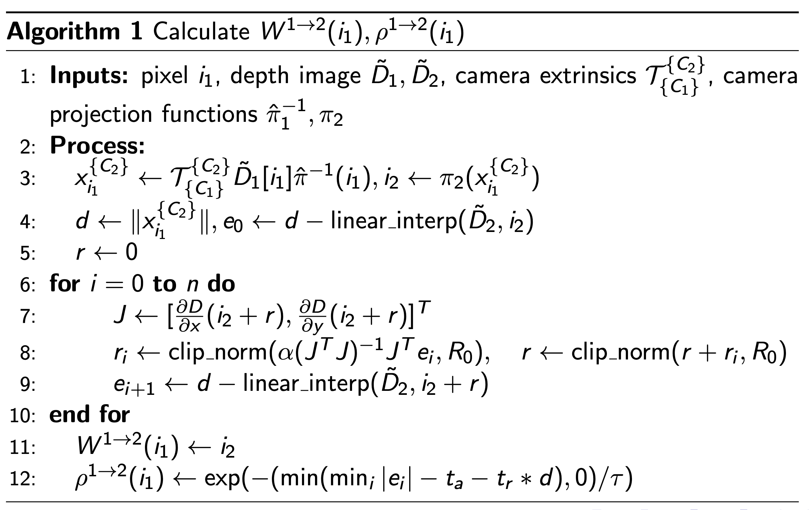
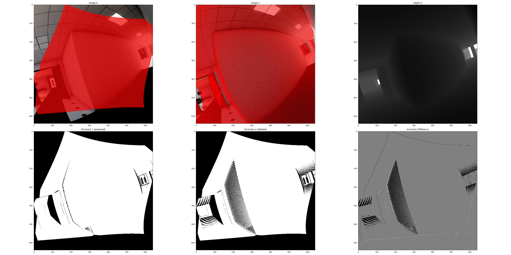
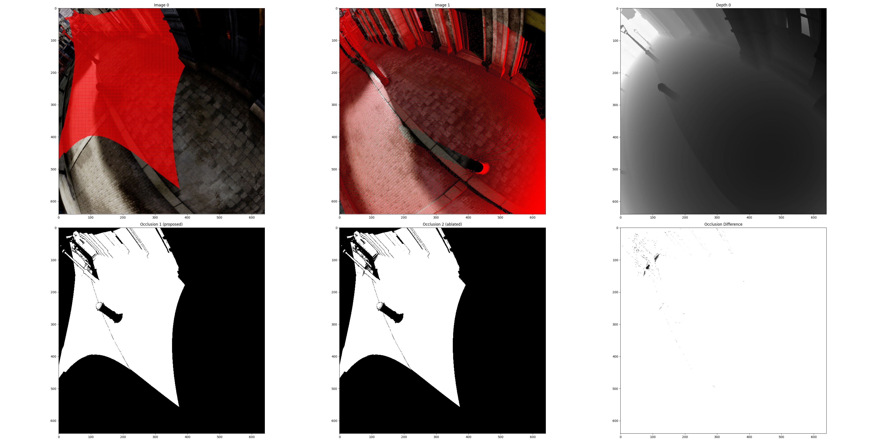
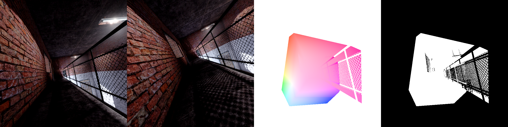
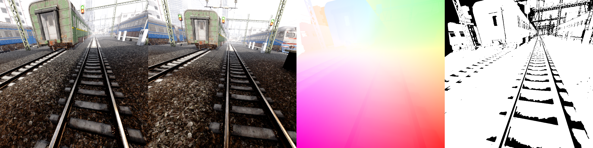
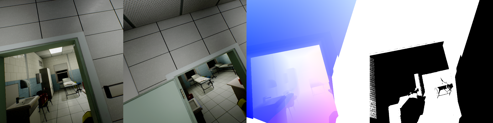

.. _new_page_label:

Dense Correspondence / Flow Sampling
====================================
Given a pair of images, computing the dense correspondence is to compute which pixel location in the second image correspond to each pixel location in the first image, and the dense confidence, or the probability that the pair is occluded. 
This is a fundamental problem in computer vision and has many applications such as optical flow, stereo matching, and image registration.

Introduction
------------
Based on the need for accurate, pixel-level correspondance information for the Match-Anything project, we select to leverage existing datasets that contains accurate camera intrinsics/extrinsics, and depth map.

However, the real problem comes from how we store depth - by depth maps. Therefore, we only have depth information at discrete points that does not capture the full information. For example, when reprojecting image points from the first image onto the second image, it will almost always land onto a non-integer coordinate, which we do not have the depth information stored. Or, in other words we only have points at integer pixel coordinate of both images, and it is unlikely that two points will coincide in the 3D space.

Problem Formulation
-------------------

Given the following information from a pair of depth images:

* Camera extrinsics :math:`\mathcal{T} \in SE(3)`
* Camera projection functions:

  .. math::

    \pi(x): \mathbb{R}^3 \to \mathcal{I}, \quad \hat{\pi}^{-1}(x): \mathcal{I} \to \mathbb{R}^3

  In which :math:`\pi(x)` projects a 3D point in the camera's coordinate system to the image coordinate, and :math:`\hat{\pi}^{-1}` maps an image coordinate to a (unit-norm) ray in 3D that will project onto this image location.

* Discrete depth image :math:`\tilde{D} \in \mathbb{R}^{W \times H}`

Find:

* (easy) Find the dense warp:

  .. math::

    W^{1 \to 2}: \mathcal{I}_1 \to \mathcal{I}_2 

  so that 3D points that are perceived at location :math:`i_1` in the **discrete** image :math:`\tilde{D}_1` will be perceived at :math:`W^{1 \to 2}(i_1)` in the **continuous** depth image :math:`D_2`.

* (hard) Find the dense confidence (occlusion):

  .. math::

    \rho^{1 \to 2}: \mathcal{I}_1 \to [0, 1]

  that the match is valid.

The dense warp is easy, since TartanAir is a synthetic dataset and all geomrtric information is accurate. The problem is to determine is the pixel from the first image directly observed in the second image, or is it occluded by another object although projecting to the expected position.

Existing methods uses depth error thresholding to determine the confidence, which is:

Previous Method: Projection error thresholding
----------------------------------------------

For each point :math:`i_1 \in \mathcal{I}_1`:

1. Project into 3D space with 
   :math:`x^{\{C_1\}}_{i_1} = \hat{\pi}_1^{-1}(i_1) \cdot \tilde{D}[i_1]`
   
2. Transform to camera 2's coordinate with 
   :math:`x^{\{C_2\}}_{i_1} = \mathcal{T}_{\{C_1\}}^{\{C_2\}} \cdot x^{\{C_1\}}_{i_1}`
   
3. Compute the projected image coordinate :math:`i_2` and expected depth :math:`d`
   
   .. math::

       i_2 = \pi_2(x^{\{C_2\}}_{i_1}), \quad d = \|x^{\{C_2\}}_{i_1}\|

4. Get the depth value at :math:`i_2` from :math:`\tilde{D}_2`, compute and threshold the error
   
    .. math::

       e = |d - \tilde{D}_2[i_2]| , \quad \rho^{1 \to 2}[i_1] = P(e < \epsilon), W^{1 \to 2}(i_1) = i_2 

    The problem is, **we only have discrete sample of** :math:`D_2`: :math:`\tilde{D}_2`. **We cannot get depth at fractional pixel location** :math:`i_2` **from discrete** :math:`\tilde{D}_2`.

    Therefore, we need to interpolate the depth map for a approximate expected depth. In this step, the expected depth may not be accurate and may lead to aliasing artifacts at large FOV change.
      
    .. math::

        \tilde{D}_2 \approx \text{intrep}(\tilde{D}_2, i_2), \quad \tilde{D}_2[i_2] \approx \tilde{D}_2[\text{nearest}(i_2)]

The rightmost image shows the occlusion map with the above method. The aliasing artifacts are shown as the block dots at the far side of the corridor.

Nearest Approximation invalidated by large FOV change
-----------------------------------------------------

With large FOV change, walls that are perpendicular in one view may become highly inclined in the other.

As shown in the figure, points projected from C1's camera model and depth map land in few pixels in C2's image. The nearest approximation will lead to a large error in the depth value as shown by the difference between the red and black lines.

Our Method
----------

We propose a fix to the above formulation by interpolating wisely:

1. Use linear interpolation to get the depth value at fractional pixel location :math:`i_2` from :math:`\tilde{D}_2`:

    .. math::

       \tilde{D}_2[i_2] = \text{bilinear}(\tilde{D}_2, i_2)

    At most cases, the depth value can be seen as continuous. The reason we do not use nearest interpolation at depth images is that depth can change rapidly, and we do not want to create non-existing depth at object edges. However, we are only using depth as verification, which means its effect is not propogated beyond occlusion calculation, and it is highly unlikely that the non-existing depth value will hit the reprojection since we use a very small threshold, minimizing the risk of doing so. 

2. We allow a small error in the pixel space.

    .. math::

        \rho^{1 \to 2}[i_1] = P\left( \min_{i \in B_{r_0}(i_2)}|d - \text{bilinear}(\tilde{D}_2, i)| < \epsilon\right)

    In other words, we threshold the lower bound of the reprojection error in a small neighborhood of the projected pixel location. This helps to compensate homography effect in non-pinhole cameras and further reduce aliasing artifacts.

In conclusion, the full method is:

With typical parameters:

1. :math:`R_0 = 0.1`: Maximum search radius in pixels
2. :math:`n = 1`: Maximum number of iterations
3. :math:`\alpha = 0.2`: Step size for gradient descent
4. :math:`t_a = 0.04`: absolute depth error threshold
5. :math:`t_r = 0.005`: relative depth error threshold
6. :math:`\tau = 0.02`: temperature for error confidence

Ablations
---------
How necessary is the above method? We ablate:

1. Nearest interpolation: We use nearest interpolation instead of bilinear interpolation.

Left - with bilinear interpolation. Mid - with nearest interpolation. Right - difference between the occlusion masks.

In this extereme example we see linear interpolation avoids major aliasing artifacts.

2. No optimization: We do not optimize for lower bound of reprojection error, and threshold the error directly.

Left - with bilinear interpolation. Mid - with nearest interpolation. Right - difference between the occlusion masks.

Some occlusion will be missing due to the lack of optimization at highly distorted regions.

Some Hard Cases
---------------

