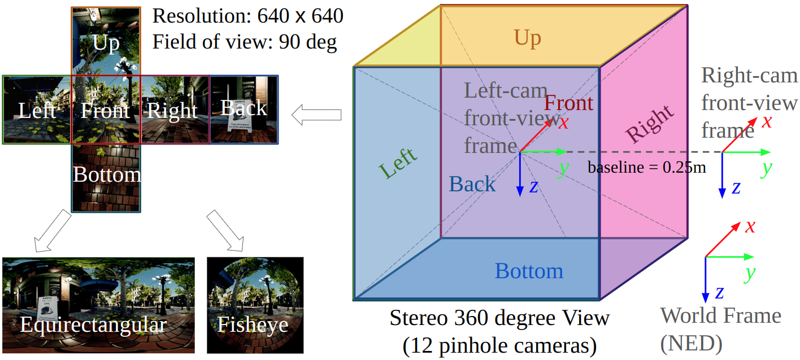
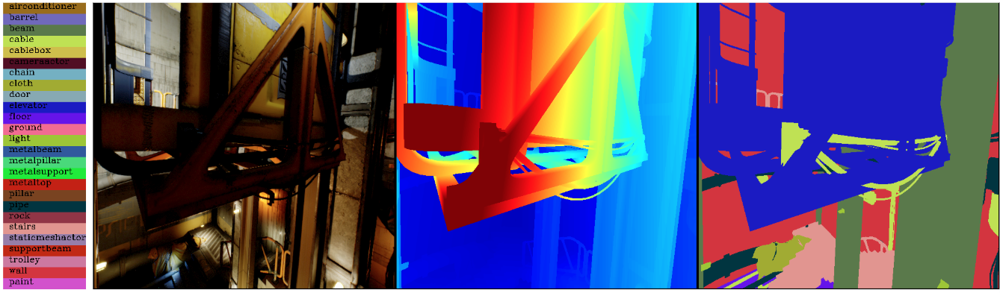

Modalities
=====================================

We placed 12 cameras in the environment, collecting raw data, including RGB images, depth images, semantic segmentation images, and camera poses. The 12 cameras all produce pinhole images with 90 degree field of views. They are separated as 2 stereo sets of 6-cameras pointing in 6 directions to cover 360 degree views. The raw data are processed to generate other modalities including optical flow, fisheye image, LiDAR, and IMU. 

Raw RGB image
--------------

For each time step, we provide 12 RGB images from 12 cameras covering a stereo set of 360 degree views. Each image is sampled using an FoV of 90 degree and a resolution of 640 x 640. The stereo baseline is 0.25 m. The intrinsics of the cameras are: 

.. code-block:: text

    - Camera model: Pinhole
    - Width: 640 pixels
    - Height: 640 pixels
    - Focal length: 320 pixels
    - Principal point: (320, 320) pixels
    - Distortion coefficients: (0, 0, 0, 0) (no distortion)

The images are sampled at 10 Hz, and the cameras are perfectly synchronized. The images are in PNG format, with 8 bits per channel.
In addition, We provide tools for adding random noise and motion blur to the images, to improve the realism. 

Raw depth image
-------------------

The depth images are sampled with the same camera intrinsics and extrinsics setups as the RGB images. It is perfectly aligned and synchronized with the RGB images. 
Each pixel of the depth image is represented using a float32 number. Depending on the environment setup, the far pixels pointing to the sky usually return a very large value. 
For the convenience of the downloading, we compress the depth image, which is H x W 32-bit format, to 4 channel PNG format H x W x 4 8-bit, which is lossless. The decoding code is as follows. 

.. code-block:: python

    import cv2
    import numpy as np

    def read_decode_depth(depthpath):
        depth_rgba = cv2.imread(depthpath, cv2.IMREAD_UNCHANGED)
        depth = depth_rgba.view("<f4")
        return np.squeeze(depth, axis=-1)

Raw semantic segmentation
-----------------------------

We provide category-level semantic labels. We overcome the disadvantage of AirSim, which provides random semantic labels with respect to each type of the models in the environment, by manually labeling the model types in all the environments. So each label in the semantic segmentation images is mapped to a semantic class. With 65 highly distinct environments, our data covers a wide range of 1447 semantic classes. However, due to the consecutive format of the data, large objects such as building, ground and sky take much higher percentage. We provide statistics files for each environment, with which people can easily balance the data while training their semantic models. There is a seg_label_map.json file for each environment, which maps the label in the segmentation image to the semantic class. Detailed statistics of the semantic classes can be found in the `semantic segmentation <segmentation.html>`_ page. To load and visualize the segmentation images, please download the `segmentation mapping file <https://github.com/castacks/tartanairpy/tree/main/segfiles.zip>`_. We provide an `example code <https://github.com/castacks/tartanairpy/tree/main/examples/seg_vis_example.py>`_ in the examples folder. It uses the seg_label_map.json file to map the labels to semantic classes. An example visualization is shown below. 

Raw camera pose
-------------------

Camera pose are in the same format with TartanAir V1. Each line of the pose file consists of 3 numbers of translation and 4 numbers of orientation in quarternion format, describing in NED frame. 

LiDAR
---------

The LiDAR data is sampled from the raw depth images of 6 left-side cameras, following the pattern of Velodyn Puck (VLP-16). As a result, the LiDAR frame is perfectly aligned with the left camera frame.  We didn't use AirSim LiDAR sensor because it is based on the collision model, which misses a lot of objects that don't have collision model, such as branches and leaves. While sampling from the depth, we balance carefully the accuracy and realism. We use linear interpolation on smooth surfaces and nearest interpolation on the edges of the objects to avoid ghost points at object edges. We provide the processing script as well as other LiDAR models, such as Velodyn Ultra Puck (VLP-32C), allowing users to create their own LiDAR data.

Fisheye and Panorama
------------------------

The fisheye and Panorama data are sampled from the raw pinhole data, thus containing all three modalities of RGB, depth, and semantics. One of the biggest challenges for the fisheye model is that those real-world fisheye cameras have diverse FoVs and distortions. We have done two things to resolve the potential generalization issue. First, we define a standard model called Linear Spherical model for fisheye images. To test real-world fisheye data with different intrinsics and distortion on the model trained on TartanAir-V2 dataset, we just need to convert the real-world data into the Linear Spherical model. Second, we open-source our sampling code, together with a rich set of fisheye and pinhole camera models, which allow users to sample their own fisheye images (see the `customization examples <examples.html#customization-example>`_ ).

Optical flow
--------------

Due to the high serving demand of the dataset, we are moving away from pre-computing the flow labels for download, as they can simply be generated from pose, intrinsics, and depth locally. Please refer to examples/flow_resampling_example.py for the code to generate optical flow from the raw data.

Also, we are changing the storage format due to increased precision of flow models. For a pair of images, the generated flow information is stored as a npz file containing the following fields:

    - flow_fwd/bwd: x,y coordinate of the flow in float32 format
    - fov_mask_fwd/bwd: boolean mask indicating if the pixel have a valid projection in the forward/backward image, i.e., is it out of the image space
    - covisible_mask_fwd/bwd: boolean mask indicating if the pixel is covisible in the forward/backward image, i.e., is it occluded by other objects in the scene

Old Optical flow format
-----------------------

Same as TartanAir V1, the optical flow is calculated for the static environments by image warping, using the camera pose and depth images. The biggest upgrades are that we accelerate the code by a Cuda implementation and provide tools for generating optical flow across any type of camera model (e.g. between pinhole and fisheye). For the convenience of the downloading, we compress the optical flow to use 8-bit representation. The decoding code is as follows.

.. code-block:: python

    import cv2
    import numpy as np

    def read_decode_flow(flowpath):
        flow16 = cv2.imread(flowpath, cv2.IMREAD_UNCHANGED)
        flow32 = flow16[:,:,:2].astype(np.float32)
        flow32 = (flow32 - 32768) / 64.0

        mask8 = flow16[:,:,2].astype(np.uint8)
        return flow32, mask8

IMU and noise model
------------------------

The IMU ground truth data is generated by interpolating the camera pose, as a result, the IMU frame is perfectly aligned and synchronized with the left camera data. In specific, we double-differentiate the translation pose using a spline for the acceleration and differentiate the orientation using a spline for the angular rate. We provide the code for customizing the data generation (such as changing the frequency) as well as the code to add realistic noise. 

Event Camera
--------------

Following the same trajectories with other modalities, we recollect the front-facing camera data at 1000 Hz. We use the `ESIM <https://github.com/uzh-rpg/rpg_esim>`_ as that is one of the fastest event camera simulators available and close to SoTA performance. We sample the 640 x 640 RGB images at 1000 Hz and then generate the events using the simulator. To improve the generalization across various event cameras we used a wide range of contrast thresholds between 0.2 to 1.0. 
Because the event data is collected separately from other modalities, some frames are inconsistent with other modalities in dynamic scenes.  

Occupancy Map
--------------

Occupancy grid maps are built while the data collection as will be detailed in the data collection pipeline section. The resolution of the map ranges from 0.125 m to 0.5 m depending on the size of the environment. The map can be used in evaluating the mapping algorithm. 