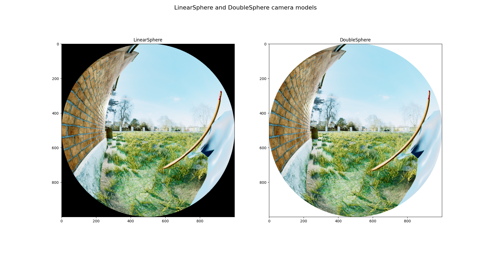

# Multiview-Stereo (MVS) Utils Examples

Hello dear beloved reader and welcome to a wild adventure into the depth of mutltiview stereo. A long time ago on a Pittsburgh hill, one that is full of squirrels, a group of vision fanatics (yes, it's crazy,) came together to create a set of tools to revolutionize the way ~~everyone~~ they deal with multiview stereo. And so, MVS Utils was born. 

Okay that was a nice story. Let's look at some examples.

## Working with camera models.
A quick test script to test a new camera model can be found at `linear_fisheye_camera_model.py`. This script will load a  collection of six images (image cube) and two camera models. It uses the camera models to project the image cube into new images. The images are compared and showed. It also verifies the consistency of the operations of a camera model by sampling an identity-rotation image, with the same camera model from itself and comparing the results.

To run the example, start with creating a directory and cloning both image_sampler and mvs_utils into it. Let's call it image_resampling. Then, run the following commands:

```bash
$ cd /the/top/of/your/directory/that/you/just/made/and/called/image_resampling
$ git clone https://github.com/castacks/image_sampler.git
$ git clone https://github.com/castacks/mvs_utils.git
$ cd mvs_utils
$ git submodule update --init --recursive
$ cd ../..
$ python3 -m image_resampling.mvs_utils.examples.linear_fisheye_camera_model
```

The output of this script should look like this:

